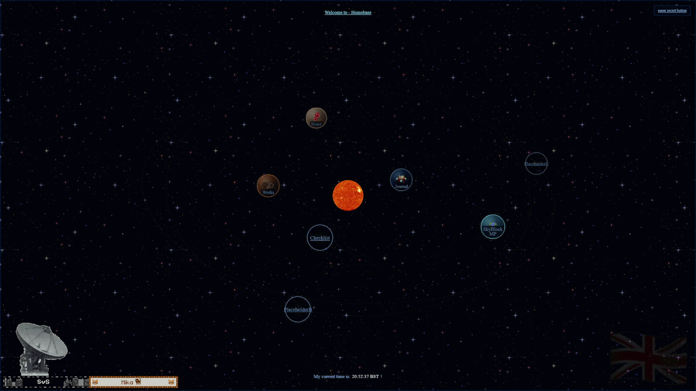
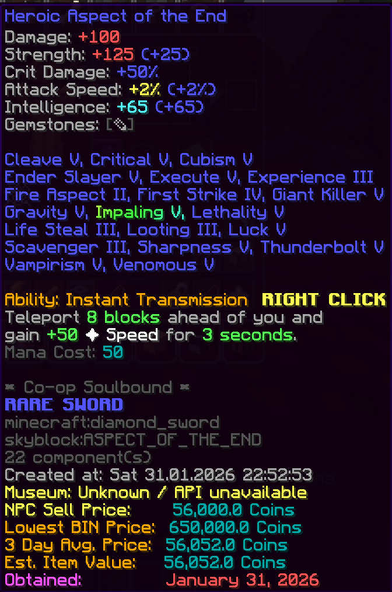
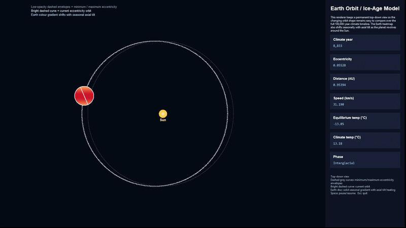
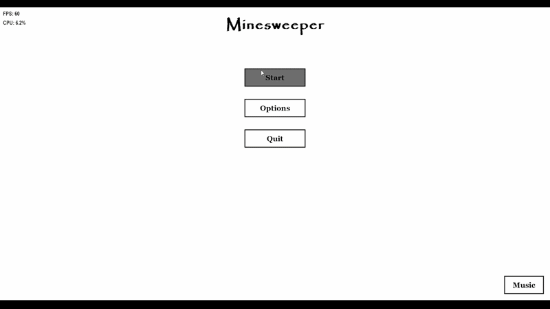

  <h1>Welcome to my profile</h1>

I am currently a university student studing Physics w/ Astrophysics and Cosmology. I do computer science projects so I stay up to date with my programming and enhancing my problem solving skills, below you will see any projects that are for show and any upcoming ones that are currently in development. Enjoy!

### But first... [svsam.com](https://www.svsam.com)

  

<h2 align="left">See my projects 🧑🏻‍💻</h2>

#### Currently in development - Webstronomy

#### [ASCII Art Generator](https://github.com/svsam/ASCIIArtGenerator)&nbsp;&nbsp;&nbsp;&nbsp;&nbsp;&nbsp;&nbsp;&nbsp;&nbsp;&nbsp;&nbsp;&nbsp;&nbsp;&nbsp;&nbsp;&nbsp;&nbsp;&nbsp;&nbsp;&nbsp;&nbsp;&nbsp;&nbsp;&nbsp;&nbsp;&nbsp;&nbsp;&nbsp;&nbsp;&nbsp;&nbsp;&nbsp;&nbsp;&nbsp;&nbsp;&nbsp;&nbsp;&nbsp;&nbsp;&nbsp;&nbsp;&nbsp;&nbsp;&nbsp;&nbsp;&nbsp;&nbsp;&nbsp;[Museum Donation Tooltip | Hypixel Skyblock](https://github.com/svsam/)&nbsp;&nbsp;&nbsp;Awaiting API approval
&nbsp;&nbsp;&nbsp;&nbsp;&nbsp;

#### [Hertzsprung Russel Diagram](https://github.com/svsam/H-R-Diagram)&nbsp;&nbsp;&nbsp;(1 million stars)&nbsp;&nbsp;&nbsp;&nbsp;&nbsp;&nbsp;&nbsp;&nbsp;&nbsp;&nbsp;&nbsp;&nbsp;&nbsp;&nbsp;&nbsp;&nbsp;&nbsp;&nbsp;&nbsp;&nbsp;&nbsp;&nbsp;&nbsp;&nbsp;&nbsp;&nbsp;&nbsp;&nbsp;&nbsp;&nbsp;&nbsp;&nbsp;&nbsp;&nbsp;&nbsp;&nbsp; [Ice age orbit of Earth](https://github.com/svsam/Ice-age-orbit)&nbsp;&nbsp;&nbsp;&nbsp; With the addition of thousands of other exo-planets (TBD)

&nbsp;&nbsp;&nbsp;&nbsp;&nbsp;&nbsp;&nbsp;&nbsp;  

###

#### [Minesweeper Algorithm](https://github.com/svsam/Minesweeper-Calculator)&nbsp;&nbsp;&nbsp;&nbsp;&nbsp;&nbsp;&nbsp;&nbsp;&nbsp;&nbsp;&nbsp;&nbsp;&nbsp;&nbsp;&nbsp;&nbsp;&nbsp;&nbsp;&nbsp;&nbsp;&nbsp;&nbsp;&nbsp;&nbsp;&nbsp;&nbsp;&nbsp;&nbsp;&nbsp;&nbsp;&nbsp;&nbsp;&nbsp;&nbsp;&nbsp;&nbsp;&nbsp;&nbsp;&nbsp;&nbsp;&nbsp;&nbsp;&nbsp;&nbsp;&nbsp;&nbsp;&nbsp;&nbsp;&nbsp;&nbsp;&nbsp;[Black Hole Simulation](https://github.com/svsam/Black-Hole-simulations)&nbsp;&nbsp;&nbsp;(Newtonian vs Gravitational Lensing modelling)

&nbsp;&nbsp;&nbsp;&nbsp;&nbsp;&nbsp;&nbsp;

<h4>What I work with:</h4>

###

  
  
  
  
  
  
  
  
  
  
  
  
  
  
  
  
  
  
  
  
  
  
  
  
  
  
  

