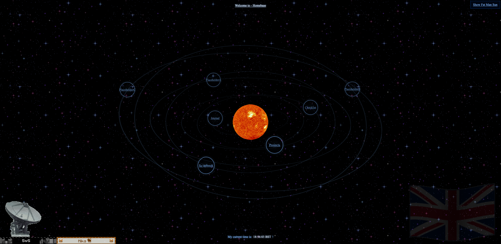

## But first... [svsam.com](https://www.svsam.com)

  

<h2 align="left">See my projects 🧑🏻‍💻</h2>

###

  
  
  

###

#### [Hertzsprung Russel Diagram](https://github.com/svsam/H-R-Diagram)&nbsp;&nbsp;&nbsp;(1 million stars)&nbsp;&nbsp;&nbsp;&nbsp;&nbsp;&nbsp;&nbsp;&nbsp;&nbsp;&nbsp;&nbsp;&nbsp;&nbsp;&nbsp;&nbsp;&nbsp;[Exoplanet orbital temperatures and modelling eccentricity](https://github.com/svsam/Exoplanet-orbital-temperatures-and-modelling-eccentricity-using-training-data)Eccentricities were prediction based

&nbsp;&nbsp;&nbsp;&nbsp;&nbsp;&nbsp;&nbsp;&nbsp;  

###

#### [Minesweeper Algorithm](https://github.com/svsam/Minesweeper-Calculator)&nbsp;&nbsp;&nbsp;&nbsp;&nbsp;&nbsp;&nbsp;&nbsp;&nbsp;&nbsp;&nbsp;&nbsp;&nbsp;&nbsp;&nbsp;&nbsp;&nbsp;&nbsp;&nbsp;&nbsp;&nbsp;&nbsp;&nbsp;&nbsp;&nbsp;&nbsp;&nbsp;&nbsp;&nbsp;&nbsp;&nbsp;&nbsp;&nbsp;&nbsp;&nbsp;&nbsp;&nbsp;&nbsp;&nbsp;&nbsp;&nbsp;&nbsp;&nbsp;&nbsp;&nbsp;&nbsp;&nbsp;&nbsp;&nbsp;&nbsp;&nbsp;[Black Hole Simulation](https://github.com/svsam/Black-Hole-simulations)(Newtonian vs Gravitational Lensing modelling)

&nbsp;&nbsp;&nbsp;&nbsp;&nbsp;&nbsp;&nbsp;  

<h4>What I work with:</h4>

###

  
  
  
  
  
  
  
  
  
  
  
  
  
  
  
  
  
  
  
  
  
  
  
  
  
  
  

